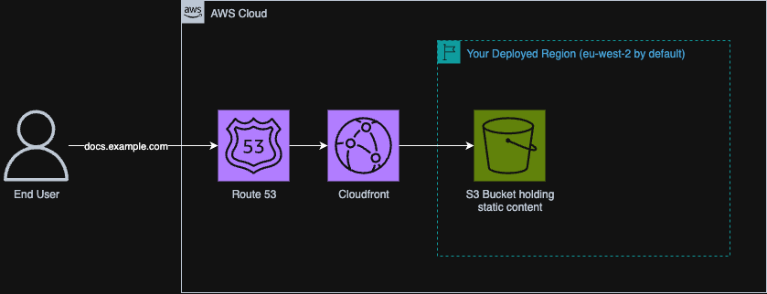

# VitePress On AWS

A simple OpenTofu/Terraform configuration to deploy a highly available VitePress site on AWS using S3, Cloudfront and Route 53.

## Prerequisites

1. OpenTofu or Terraform installed
1. An AWS account (where you have sufficient privileges)
1. A preconfigured Route 53 hosted zone in the account
1. Your VitePress site in `/docs/` (A sample/starter one is provided)

## Deployment

This stack will work with either Terraform or OpenTofu. These instructions will assume you are using OpenTofu however if you are using Terraform wherever you see the command `tofu`, replace it with `terraform`. The CLIs are almost equivalent.

1. Login to the target AWS account

Authenticate using any method supported by the [AWS Provider documentation](https://registry.terraform.io/providers/hashicorp/aws/latest/docs).

A typical setup might require you to set the following environment variables before execution

```bash
export AWS_ACCESS_KEY_ID="your_access_key_id"
export AWS_SECRET_ACCESS_KEY="your_secret_access_key"
```

However, if you have a more complex setup (eg, SSO) you can also use the following environment variables for authentication:

```text
AWS_PROFILE
AWS_CONFIG_FILE
AWS_SHARED_CREDENTIALS_FILE
```

2. Create `terraform.tfvars`

```hcl
region              = "eu-west-2" # This is where the S3 bucket will be placed
bucket_prefix       = "vitepress" # The prefix for the S3 bucket
domain_name         = "example.com" # Your Route 53 hosted zone domain name
vitepress_subdomain = "docs" # The subdomain where you docs will be (use "@" to have your docs at the domain root)
```

3. Initialize the OpenTofu provider

```bash
tofu init
```

4. Plan the infrastructure

```bash
tofu plan
```

This command will output all the changes that the configuration will do, you should review it to ensure that it looks sensible.

5. Apply the infrastructure

```bash
tofu apply
```

This will create all the infrastructure, the Cloudfront distribution and Route 53 changes can take a little bit of time (~5-10 minutes) to fully create, once fully complete it will output the URLs of the frontend.

## Deletion

> ⚠️ Warning: The following is a highly destructive action!

```bash
tofu destroy
```

This may take up to 5-10 minutes but will fully delete the provisioned infrastructure (this command will NOT delete your manually created Route 53 hosted zone).

## Cost

> ⚠️ Note: These are just rough estimates for guidance. Actual AWS charges will vary depending on usage, caching, region, and configuration. Always double-check with the [AWS Pricing Calculator](https://calculator.aws/#/).

This estimate assumes 1 million visits/month (each request serving ~100 KB, ~100 GB total transfer):

- Route 53 hosted zone: $0.50/month  
- Route 53 DNS queries: up to $0.40/month (often less due to caching)  
- S3 bucket (storage + origin requests): <$0.10/month (assuming good CloudFront cache hit rate; storage adds only pennies for a small site)  
- CloudFront requests & data transfer:  
  - Within free tier: $0 (covers 1 TB data out + 10M requests/month)  
  - Outside free tier: ~$0.085 per GB data transfer out + $0.0075 per 10,000 HTTPS requests  

Likely monthly cost (within free tier): ~$0.60–$1.00  
Outside free tier (if you exceed it): ~$8.50 per 100 GB + negligible request charges

## Infrastructure Diagram

This OpenTofu configuration creates the following infrastructure (this is only a high level diagram).


## VitePress

This project is a wrapper for [VitePress](https://vitepress.dev/) that makes it easy to deploy your VitePress site on AWS. **It is not officially affiliated with VitePress.**

For official VitePress documentation, visit [vitepress.dev](https://vitepress.dev/guide/what-is-vitepress).

### Running Locally

To run your VitePress app locally:

```bash
# Install dependencies
npm install

# Start the VitePress dev server
npm run docs:dev
```

Your site will be available at `http://localhost:5173` by default.

For instructions on deploying your site, see [Deployment](#deployment).

## License

This project is licensed under the **MIT License**. See [LICENSE](./LICENSE) for details.
